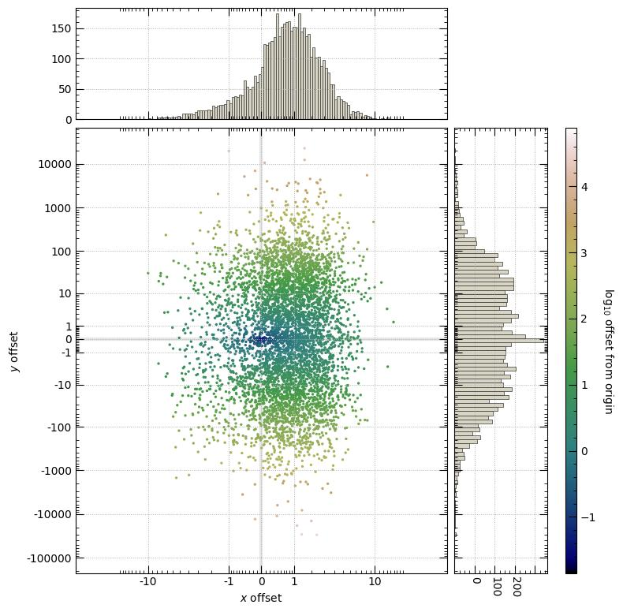

pysymlog -- Symmetric (signed) logarithm scale for your python plots

version 1.0.1


API documentation: [https://pysymlog.readthedocs.io](https://pysymlog.readthedocs.io)

Examples: [https://github.com/pjcigan/pysymlog/examples/tutorial_mpl.ipynb](https://github.com/pjcigan/pysymlog/examples/tutorial_mpl.ipynb)


[](https://badge.fury.io/py/pysymlog)
[](https://pepy.tech/project/pysymlog)


This package provides some utilities for binning, normalizing colors, wrangling tick marks, and more, in symmetric logarithm space.  That is, for numbers spanning positive *and* negative values, working in log scale with a transition through zero, down to some threshold.  Utilities are given for calculating arrays and histograms, plotting in matplotlib, and plotting in plotly.  This can be quite useful for representing data that span many scales like standard log-space, but that include values of zero (that might be returned by physical measurement) or even negative values (for example offsets from some reference, or things like temperatures).

It should be noted that of course matplotlib now has the 'symlog' scale (with linear values near zero, below some threshold) as well as asinh scale (also with smooth transition through zero), providing quite similar matplotlib plotting functionality for setting axis scales and colormap normalization.  Beyond simply providing one more alternative, this package provides convenient functions for creating 1D and 2D histograms and symmetric log bins, generating logspace-like arrays through zero and managing matplotlib major and minor ticks in symlog space, as well as bringing symmetric log scaling functionality to plotly.


Sharing/Customization: Please, play around!  (MIT License)

If you find this useful for your work, giving this package a nod in your acknowledgments would be greatly appreciated.  


-----------------------

# Dependencies

* numpy

* matplotlib (optional)

* plotly (optional)

- Tested in python 3.7, 3.10


# Installation

Install with pip
```console
pip install pysymlog
```


# Usage

Example basic usage, without importing any plot packages:
```python
import pysymlog as psl

## Making a histogram in symmetric log space
counts, bin_edges = psl.symlogbin_histogram(data, Nbins=50, shift=1, base=10)

## Making a 2D histogram in symmetric log space
counts, bins_x, bins_y = psl.symlogbin_histogram2d(xdata, ydata, 50, limits=['auto','auto'], shift=1, base=10)
```

Example basic usage with matplotlib:
```python
import pysymlog

## Loading matplotlib utilities and registering 'symmetriclog' scale
pysymlog.register_mpl()

## Making a plot in symmetriclog scale
from matplotlib import pyplot as plt
ax1=plt.subplot(111)
plt.plot(xdata,ydata);
plt.yscale(SymmetricLogarithmScale(ax1,shift=0.01))
# or
plt.yscale('symmetriclog',shift=0.01)
plt.show()

```

Example basic usage with plotly:
```python
import pysymlog

## Loading the plotly utilities
pysymlog.register_plotly()

## Making a scatter plot with plotly.graph_objects, log scale on y axis
fig = go.Figure()
psl.go_scatter_symlog(fig, xdata, ydata, xy='y')
fig.show()

## Making a line plot with plotly.express, log scale on y axis
fig = psl.px_line_symlog(xdata, ydata, xy='y')
fig.show()

```


API documentation can be found at [https://pysymlog.readthedocs.io](https://pysymlog.readthedocs.io)

See the [examples jupyter notebook](https://github.com/pjcigan/pysymlog/examples/tutorial_mpl.ipynb) for much more detail and example usage.


Example gallery:





